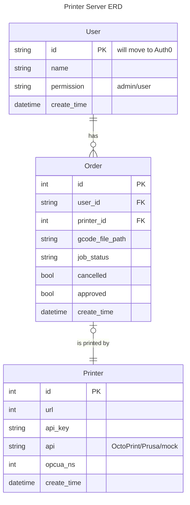

# MES Printing Server

The MES Printing Server provides GUI for Monash engineering students to submit and monitor 3D model printing jobs.
Printing jobs are executed by calling Octo APIs to 3D printers in the lab, and real time printing data is
synchronized to the OPCUA server, which is the central control of the lab.

MES works with other systems (matrix, storage...) to provide automated printing services:

* students submit printing jobs
* jobs are picked and executed
* finished plates are picked by robots to storage
* students get notified and come to the lab
* models are picked from storage to students

## Architecture

The printing server runs several printer workers.
Each worker maintains a connection to one octoprint server and call octoprint APIs when needed.
Responses of APIs are pushed to the OPCUA server.

## Build

We use [poetry](https://python-poetry.org/) to manage dependencies. Please
first [install poetry](https://python-poetry.org/docs/#installation).

Then, use poetry to install dependencies:

```shell
poetry install
```

## Configuration

Configuration can be parsed from environment variables or a `.env` file.

You can generate a `.env` file for local development by running the shell command below.
An [example env file](./.env.example) is also available.

```shell
cat << EOF > .env
DATABASE_URL='sqlite+aiosqlite://'
OPCUA_SERVER_URL='opc.tcp://mock-server:4840'
UPLOAD_PATH='./upload'
EOF
```

Or setup environment variables directly

```shell
EXPORT DATABASE_URL='sqlite+aiosqlite://'
EXPORT OPCUA_SERVER_URL='opc.tcp://127.0.0.1:4840'
EXPORT UPLOAD_PATH='./upload'
```

### Inspect current config

```shell
poetry run setting
```

### Required config

* `DATABASE_URL`: URL of the database
* `OPCUA_SERVER_URL`: URL of the OPCUA server
* `UPLOAD_PATH`: path to store uploaded `GCode` files

### Optional config

* `PRINTER_WORKER_INTERVAL`: if set to `x`, all printer workers will run every `x` seconds
* `MOCK_PRINTER_INTERVAL`: if set to `x`, all mock printers will update inner states every `x` seconds
* `MOCK_PRINTER_JOB_TIME`: mock printers will take `MOCK_PRINTER_INTERVAL` * `MOCK_PRINTER_JOB_TIME` seconds to print
  all printing jobs
* `MOCK_PRINTER_TARGET_BED_TEMPERATURE`: target bed temperature of the mock printer
* `MOCK_PRINTER_TARGET_BED_NOZZLE`: target nozzle temperature of the mock printer

## Mocking

### OPC UA Server

If the OPC UA Server url contains `mock` (for example `opc.tcp://mock-server:4840`), the server will use a mock OPC UA
server.

### Mock Printer

If value of a printer record's `api` column is `Mock`, the server will use a mock printer.

```postgresql
INSERT INTO public.printer (create_time, url, api_key, api, opcua_ns)
VALUES ('2024-01-20 19:00:16.000000', 'http://localhost:5000', 'foobar', 'Mock', 1);
```

### In memory Database

You can specify `sqlite+aiosqlite:///` as the database URL to tell the server to set up an in memory SQLite database.

## Run

Run the printer server:

```shell
poetry run server
```

The API docs are available at `http://localhost:8000/api/v1/docs`

## Test

```shell
poetry run pytest tests/
```

## ERD



## Contribute

TODO: pre-commit hook

Make sure you format files with `black` before submitting a PR.

```shell
poetry run black .
```

## Resources

* [asyncio](https://docs.python.org/3/library/asyncio.html)
* [pytest](https://docs.pytest.org/en/7.4.x/)
    * [How to invoke pytest](https://docs.pytest.org/en/7.1.x/how-to/usage.html)
    * [How to use fixtures](https://docs.pytest.org/en/7.4.x/how-to/fixtures.html)
* [SQLAlchemy](https://www.sqlalchemy.org/)
    * [ORM Quick Start](https://docs.sqlalchemy.org/en/20/orm/quickstart.html)
    * [Writing SELECT statements for ORM Mapped Classes](https://docs.sqlalchemy.org/en/20/orm/queryguide/select.html)
    * [Session.commit()](https://docs.sqlalchemy.org/en/20/orm/session_api.html#sqlalchemy.orm.Session.commit)
    * [asyncio extension](https://docs.sqlalchemy.org/en/20/orm/extensions/asyncio.html#synopsis-orm)
    * [state management](https://docs.sqlalchemy.org/en/20/orm/session_state_management.html)
