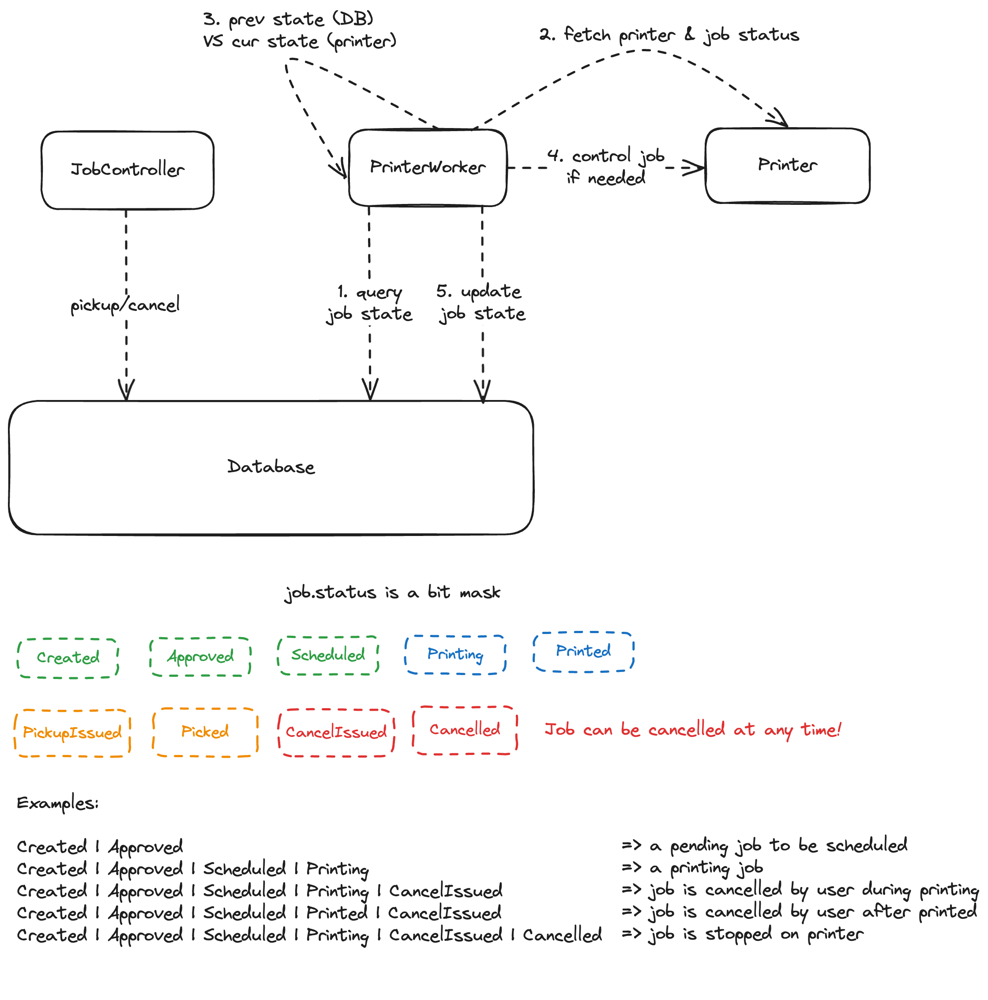
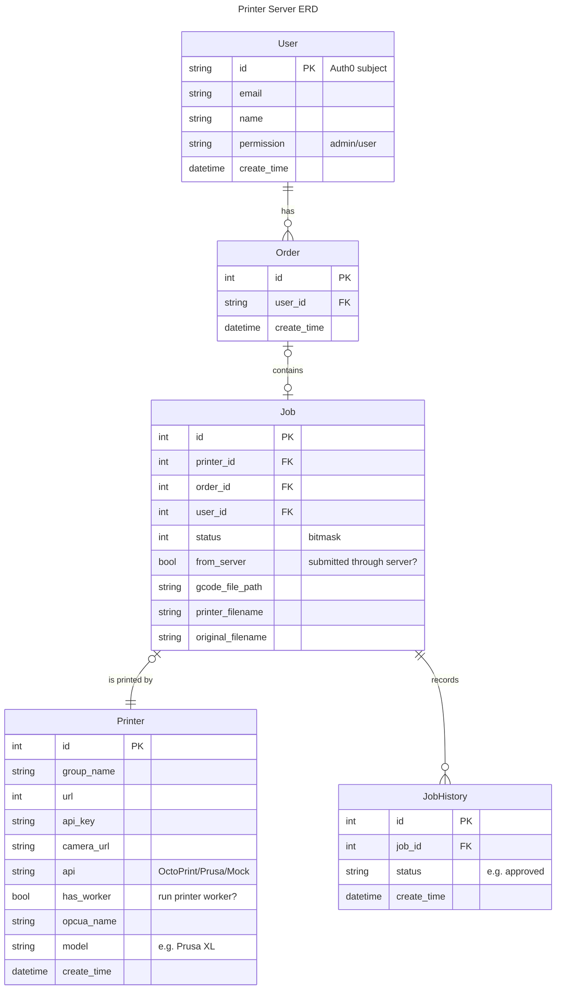

# MES Printing Server

The MES Printing Server provides GUI for Monash engineering students to submit and monitor 3D model printing jobs.
Printing jobs are executed by calling Octo APIs to 3D printers in the lab, and real time printing data is
synchronized to the OPCUA server, which is the central control of the lab.

MES works with other systems (matrix, storage...) to provide automated printing services:

* students submit printing jobs
* jobs are picked and executed
* finished plates are picked by robots to storage
* students get notified and come to the lab
* models are picked from storage to students

## Architecture

The printing server runs several printer workers.
Each worker maintains a connection to one octoprint server and call octoprint APIs when needed.
Responses of APIs are pushed to the OPCUA server.

## Run in a Container

```shell
sudo docker build -t mes-printing-server .

sudo docker run --rm --name mes-printing-server \
 -v ./upload:/var/lib/mes/gcode-files \
 -e UPLOAD_PATH="/var/lib/mes/gcode-files" \
 mes-printing-server
```

## Run Locally

We use [poetry](https://python-poetry.org/) to manage dependencies. Please
first [install poetry](https://python-poetry.org/docs/#installation).

Then, use poetry to install dependencies:

```shell
poetry install
```

Next, create an `.env` file to store configuration.
We'll use an in-memory DB and a simulated OPC UA server,
so you don't need to set up other services for now.

```shell
cat << EOF > .env
DATABASE_URL='sqlite+aiosqlite://'
OPCUA_SERVER_URL='opc.tcp://mock-server:4840'
UPLOAD_PATH='./upload'
EOF
```

Finally, run the printing server in the virtual environment:

```shell
poetry shell
poetry run server
```

The API docs are available at `http://localhost:8000/api/v1/docs`

## Configuration

Configuration can be parsed from environment variables or a `.env` file.

You can generate a `.env` file for local development by running the shell command below.
An [example env file](./.env.example) is also available.

```shell
cat << EOF > .env
DATABASE_URL='sqlite+aiosqlite://'
OPCUA_SERVER_URL='opc.tcp://mock-server:4840'
UPLOAD_PATH='./upload'
EOF
```

Or setup environment variables directly

```shell
EXPORT DATABASE_URL='sqlite+aiosqlite://'
EXPORT OPCUA_SERVER_URL='opc.tcp://127.0.0.1:4840'
EXPORT UPLOAD_PATH='./upload'
```

### Inspect current config

```shell
poetry run setting
```

### Required config

* `DATABASE_URL`: URL of the database
* `OPCUA_SERVER_URL`: URL of the OPCUA server
* `UPLOAD_PATH`: path to store uploaded `GCode` files

### Optional config

* `AUTO_SCHEDULE`: if set to `true`, the schedule will assign pending jobs to ready printers
* `PRINTER_WORKER_INTERVAL`: if set to `x`, all printer workers will run every `x` seconds
* `ORDER_FETCHER_INTERVAL`: if set to `x`, the printer server will fetch pending orders every `x` seconds
* `MOCK_PRINTER_INTERVAL`: if set to `x`, all mock printers will update inner states every `x` seconds
* `MOCK_PRINTER_JOB_TIME`: mock printers will take `MOCK_PRINTER_INTERVAL` * `MOCK_PRINTER_JOB_TIME` seconds to print
  all printing jobs
* `MOCK_PRINTER_TARGET_BED_TEMPERATURE`: target bed temperature of the mock printer
* `MOCK_PRINTER_TARGET_BED_NOZZLE`: target nozzle temperature of the mock printer

## Mocking

### OPC UA Server

If the OPC UA Server url contains `mock` (for example `opc.tcp://mock-server:4840`), the server will use a mock OPC UA
server.

### Mock Printer

If `api` of a printer is `Mock`, the server will use a mock printer instead of calling REST APIs on a real printer.

```shell
curl --location 'http://localhost:8000/api/v1/printers' \
--header 'Content-Type: application/json' \
--data '{
    "url": "http://mock-printer1:5000",
    "api": "Mock",
    "api_key": "FJZ3PO9",
    "opcua_name": "Printer1",
    "worker": true
}'
```

### In memory Database

You can specify `sqlite+aiosqlite:///` as the database URL to tell the server to set up an in memory SQLite database.

## Test

```shell
poetry run pytest tests/
```

## Printer Worker

A printer worker periodically fetches current status of a printer and
acts call printer APIs to control printing jobs.
Printer worker monitors states of **all** printing jobs
(submitted through both server and printer), but only controls
jobs (print/cancel) submitted though server.

As the diagram shown below, the printer worker queries the previous job status from database,
and fetch current job status from the printer. By comparing previous and current status,
the printer worker knows what happened between these states and
react according to the state change.

Printer worker is **stateless**, which means it doesn't maintain any internal states.
This prevents data loss if the printing server is down when tracking a printing job,
and simplifies testing.



## ERD



## Contribute

* Fork
* Install pre-commit hooks

  ```shell
  pre-commit install
  ```

* Write codd and unit tests
  ```shell
  pytest tests/
  ```

* run static typing checks

  ```shell
  mypy
  ```

* Push to your repo and Submit a pull request

## Resources

* Prusa Web Link
    * [Wi-Fi and PrusaLink setup](https://help.prusa3d.com/guide/wi-fi-and-prusalink-setup-xl-firmware-up-to-4-7-5_419630)
    * [Adding the printer to Prusa Connect](https://help.prusa3d.com/guide/adding-the-printer-to-prusa-connect-xl-firmware-up-to-4-7-5_420001)
* [asyncio](https://docs.python.org/3/library/asyncio.html)
* [pytest](https://docs.pytest.org/en/7.4.x/)
    * [How to invoke pytest](https://docs.pytest.org/en/7.1.x/how-to/usage.html)
    * [How to use fixtures](https://docs.pytest.org/en/7.4.x/how-to/fixtures.html)
* [SQLAlchemy](https://www.sqlalchemy.org/)
    * [ORM Quick Start](https://docs.sqlalchemy.org/en/20/orm/quickstart.html)
    * [Writing SELECT statements for ORM Mapped Classes](https://docs.sqlalchemy.org/en/20/orm/queryguide/select.html)
    * [Session.commit()](https://docs.sqlalchemy.org/en/20/orm/session_api.html#sqlalchemy.orm.Session.commit)
    * [asyncio extension](https://docs.sqlalchemy.org/en/20/orm/extensions/asyncio.html#synopsis-orm)
    * [state management](https://docs.sqlalchemy.org/en/20/orm/session_state_management.html)
