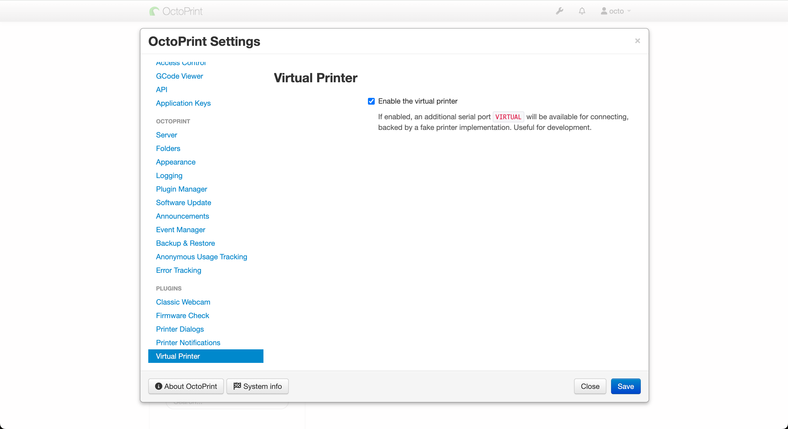
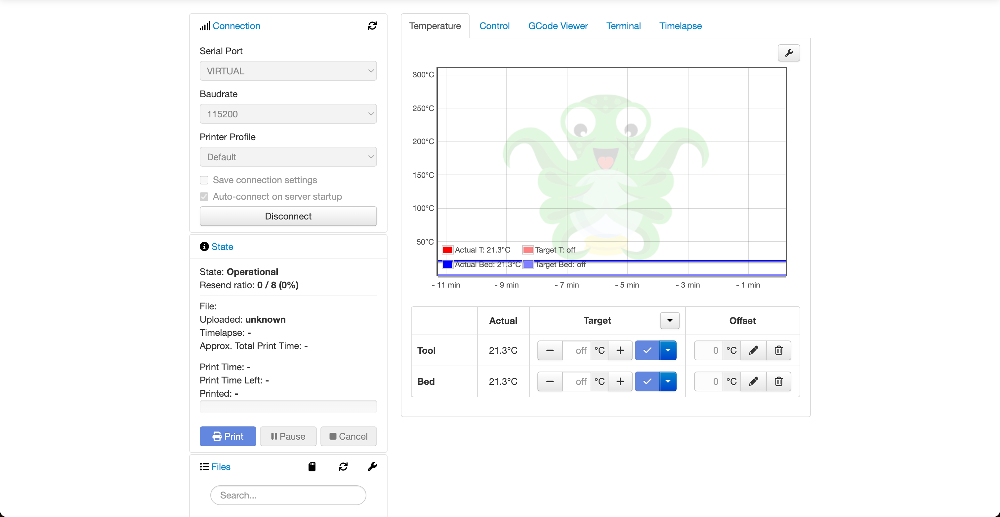
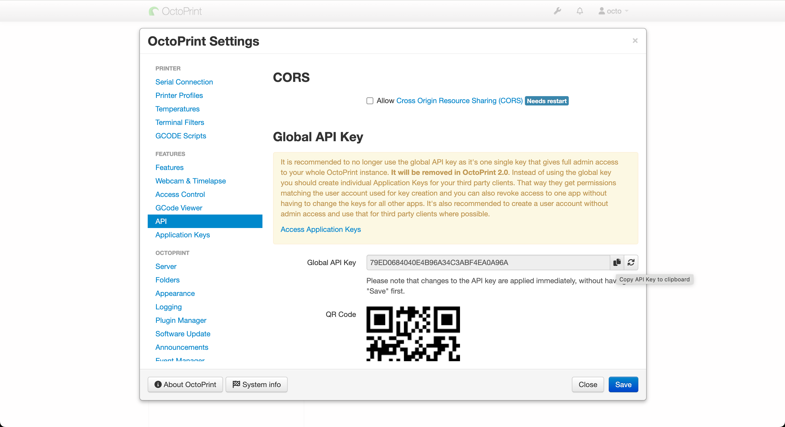

# Virtual Octo Printer

We can use a virtual printer in octoprint to mock an actual printer.

First, run an octoprint server in a Docker container:

```shell
docker run -d -v /var/octoprint/:/octoprint -p 80:80 --name octoprint octoprint/octoprint
```

Change `80` to another port number if it is already in use.

After the container starts running, go to `localhost:80` and follow the setup wizard to create an account.

Next, enable virtual printer in settings



Finally, go to the home page, select `virtual` under `Connection -> Serial Port`, and then click `Connect`.



Now you can control the virtual printer with REST APIs. Make sure you include the api key in request headers.



Please also check [example REST API requests](../examples/octo-rest-api/octo-rest-api.http).